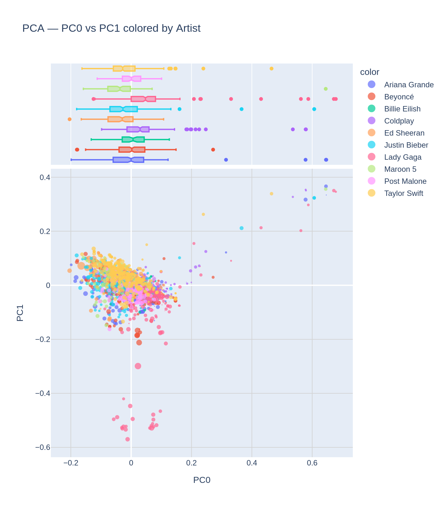
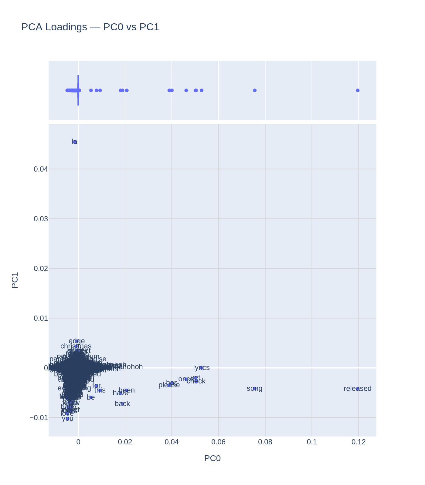
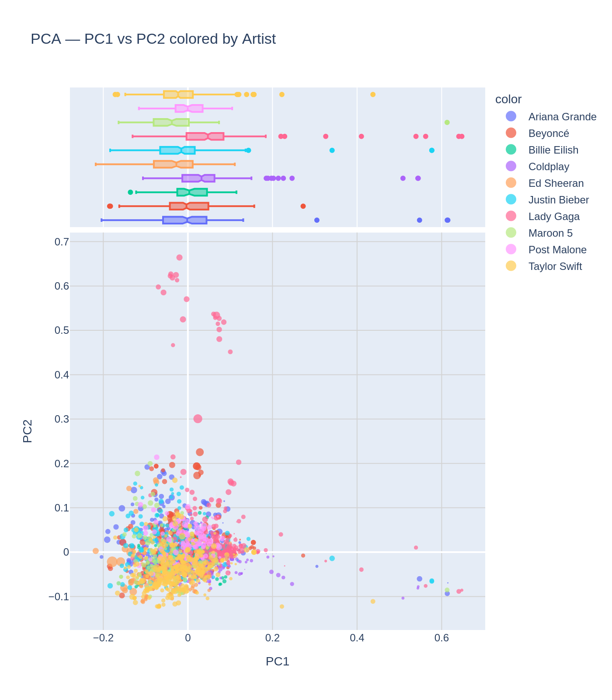
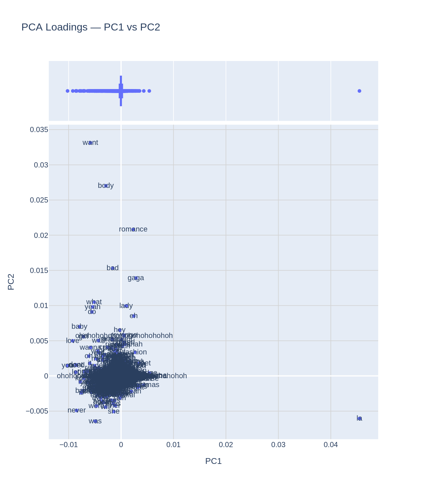
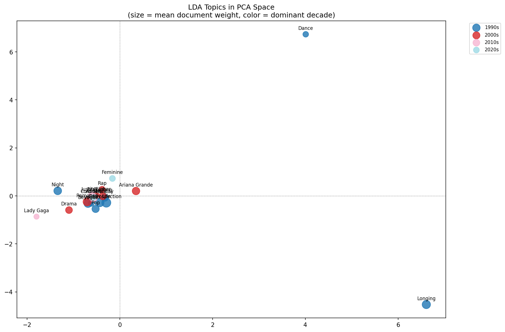
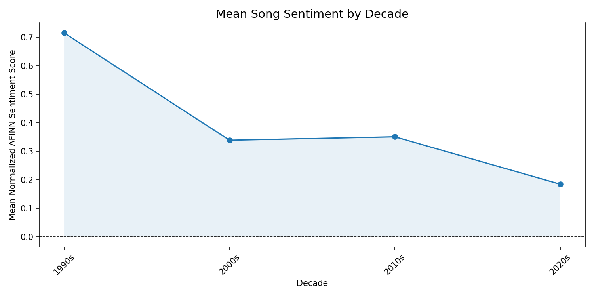
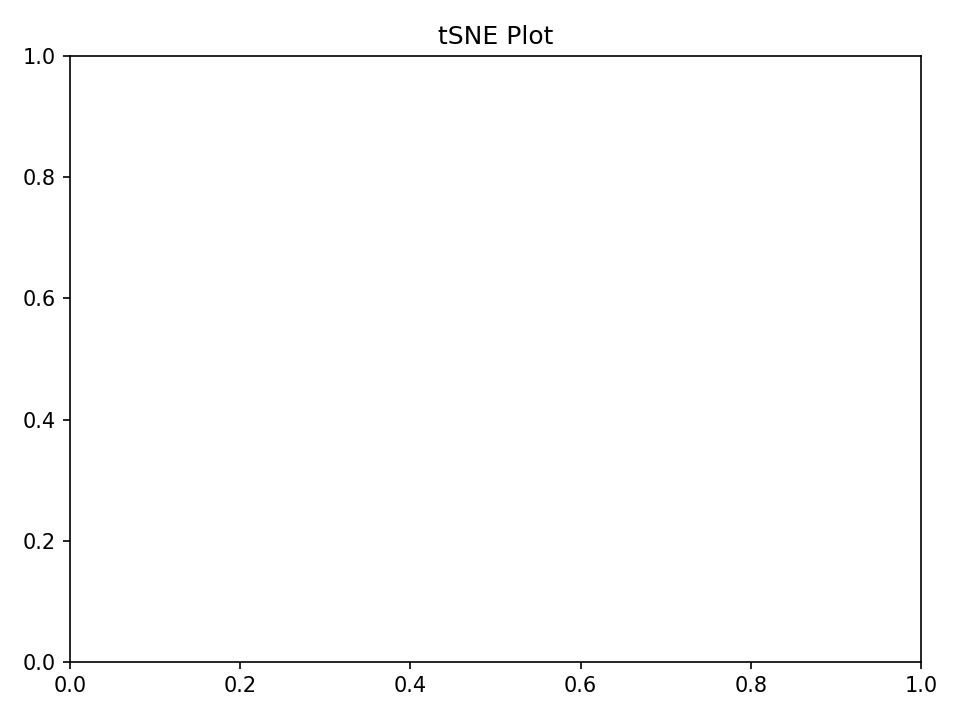
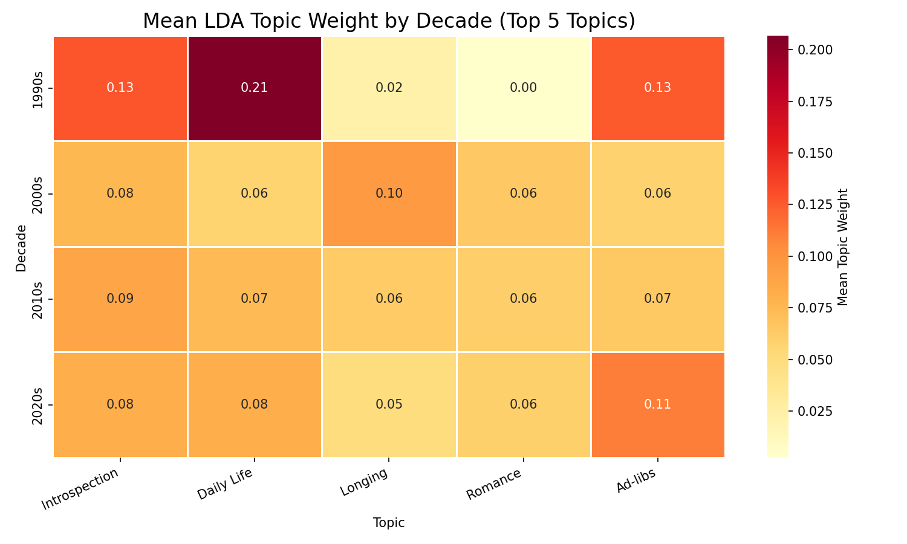
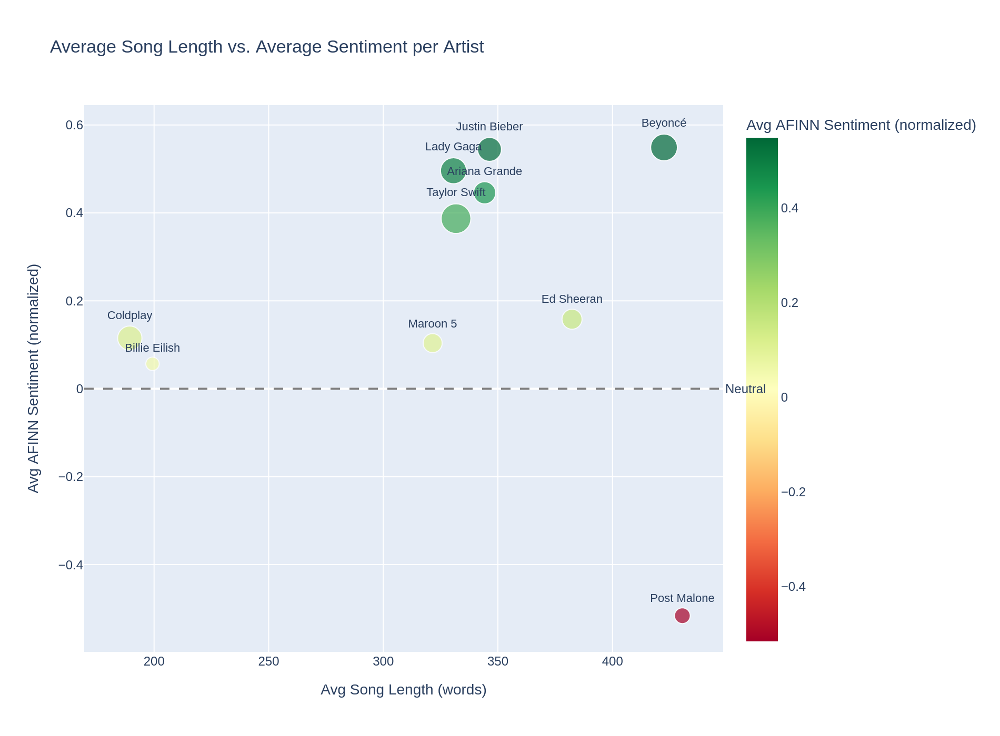
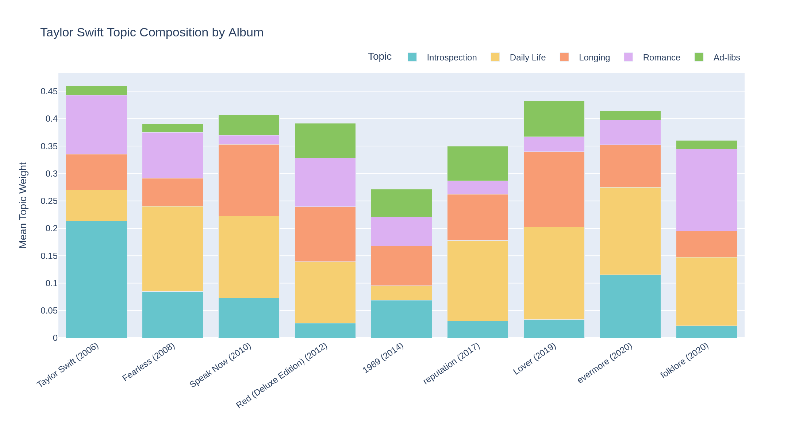

# DS 5001 Text as Data — Final Project Notebook

## Metadata

- **Full Name:** Maggie Crowner
- **Userid:** mqq9sb
- **GitHub Repo URL:** https://github.com/maggiecrowner/DS5001-Final-Project/tree/main
- **UVA Box URL:** https://virginia.box.com/s/aq7x82f8iy5llnog0bymnwls7ayorzgn

---

## Overview

The goal of the final project is for you to create a digital analytical edition of a corpus using the tools, practices, and perspectives you've learned in this course. You will select a corpus that has already been digitized and transcribed, parse that into an F-compliant set of tables, and then generate and visualize the results of a series of fitted models. You will also draw some tentative conclusions regarding the linguistic, cultural, psychological, or historical features represented by your corpus. The point of the exercise is to have you work with a corpus through the entire pipeline from ingestion to interpretation.

Specifically, you will acquire a collection of long-form texts and perform the following operations:

- Convert the collection from their source formats (F0) into a set of tables that conform to the Standard Text Analytic Data Model (F2).
- Annotate these tables with statistical and linguistic features using NLP libraries such as NLTK (F3).
- Produce a vector representation of the corpus to generate TFIDF values to add to the TOKEN (aka CORPUS) and VOCAB tables (F4).
- Model the annotated and vectorized model with tables and features derived from the application of unsupervised methods, including PCA, LDA, and word2vec (F5).
- Explore your results using statistical and visual methods.
- Present conclusions about patterns observed in the corpus by means of these operations.

When you are finished, you will make the results of your work available in GitHub (for code) and UVA Box (for data). You will submit to Gradescope (via Canvas) a PDF version of a Jupyter notebook that contains the information listed below.

### Some Details

- Please fill out your answers in each task below by editing the markdown cell.
- Replace text that asks you to insert something with the thing, i.e. replace `(INSERT IMAGE HERE)` with an image element, e.g. ``.
- For URLs, just paste the raw URL directly into the text area. Don't worry about providing link labels using `[label](link)`.
- Please do not alter the structure of the document or cell, i.e. the bulleted lists.
- You may add explanatory paragraphs below the bulleted lists.
- Please name your tables as they are named in each task below.
- Tasks are indicated by headers with point values in parentheses.

---

## Raw Data

### Source Description (1)

Provide a brief description of your source material, including its provenance and content. Tell us where you found it and what kind of content it contains.

*The Song Lyrics data set was compiled by Kaggle user deepshah16. It is a collection of song lyrics from 21 different artists, with csv or json files available to download for each artist. 10 artists (Ariana Grande, Justin Bieber, Post Malone, Maroon5, Taylor Swift, Beyonce, Lady Gaga, Ed Sheeran, ColdPlay, and Billie Eilish) were selected for this corpus.*

### Source Features (1)

- **Source URL:** https://www.kaggle.com/datasets/deepshah16/song-lyrics-dataset
- **UVA Box URL:** https://virginia.box.com/s/af0cadpz4j7l0ye8ukkvz651y9dkr42g
- **Number of raw documents:** 3073 songs (from the 10 artists specified above)
- **Total size of raw documents (e.g. in MB):** ~4.93 MB
- **File format(s), e.g. XML, plaintext, etc.:** CSV

### Source Document Structure (1)

Provide a brief description of the internal structure of each document. Describe the typical elements found in a document and their relation to each other. For example, a corpus of letters might be described as having a date, an addressee, a salutation, a set of content paragraphs, and a closing. If there are various structures, state that.

*The data is split into columns indicating the artist, album, song title, lyrics, release date, and release year. Each document (song) is represented as one row in the data set, with the full song lyrics written in the lyrics column, and the other columns providing supplementary information about the song.*

---

## Parsed and Annotated Data

Parse the raw data into the three core tables of your edition: the `LIB`, `CORPUS`, and `VOCAB` tables. These tables will be stored as CSV files with header rows. You may consider using `|` as a delimiter. Provide the following information for each.

### LIB (2)

The source documents the corpus comprises. These may be books, plays, newspaper articles, abstracts, blog posts, etc. Note that these are not documents in the sense used to describe a bag-of-words representation of a text, e.g. chapter.

- **UVA Box URL:** https://virginia.box.com/s/fhzudg34je9xls5bfcbi4xdnaiek74rj
- **GitHub URL for notebook used to create:** https://github.com/maggiecrowner/DS5001-Final-Project/blob/main/LIB.ipynb
- **Delimiter:** |
- **Number of observations:** 2960 (songs with unreleased lyrics were removed from the raw files)
- **List of features, including at least three that may be used for model summarization (e.g. date, author, etc.):** Artist, Album, Title, Year, Decade, doc_length_words, doc_length_chars
- **Average length of each document in characters:** 1642.78

### CORPUS (2)

The sequence of word tokens in the corpus, indexed by their location in the corpus and document structures.

- **UVA Box URL:** https://virginia.box.com/s/ijkqovrdgvrmctsdqobymig2p98q9x0m
- **GitHub URL for notebook used to create:** https://github.com/maggiecrowner/DS5001-Final-Project/blob/main/CORPUS.ipynb
- **Delimiter:** |
- **Number of observations** (should be >= 500,000 and <= 2,000,000): 985352
- **OHCO Structure (as delimited column names):** Artist, Album, Title, token_str
- **Columns (as delimited column names, including `token_str`, `term_str`, `pos`, and `pos_group`):** Artist, Album, Title, WordID (multiindex); token_str, term_str, pos, pos_group

### VOCAB (2)

The unique word types (terms) in the corpus.

- **UVA Box URL:** https://virginia.box.com/s/a2njs9ipjxrgam9un7sr4yn3f6f196ny
- **GitHub URL for notebook used to create:** https://github.com/maggiecrowner/DS5001-Final-Project/blob/main/VOCAB.ipynb
- **Delimiter:** |
- **Number of observations:** 19104
- **Columns (as delimited names, including `n`, `p`, `i`, `dfidf`, `porter_stem`, `max_pos`, `max_pos_group`, `stop`):** term_str (index); n, p, i, dfidf, porter_stem, max_pos, max_pos_group, stop, ngram_length

> **Note:** Your VOCAB may contain ngrams. If so, add a feature for `ngram_length`.

**Top 20 significant words in the corpus by DFIDF:**

*say, baby, time, want, yeah, pre, youre, got, make, way, let, ill, wanna, need, come, cause, right, feel, oh, heart*

---

## Derived Tables

### BOW (3)

A bag-of-words representation of the CORPUS.

- **UVA Box URL:** https://virginia.box.com/s/jnjmet326j10jijnzwjcj87n35dfjkwl
- **GitHub URL for notebook used to create:** https://github.com/maggiecrowner/DS5001-Final-Project/blob/main/BOW.ipynb
- **Delimiter:** |
- **Bag (expressed in terms of OHCO levels):** Title
- **Number of observations:** 235266
- **Columns (as delimited names, including `n`, `tfidf`):** Artist, Album, Title, term_str (multiindex); n

### DTM (3)

A representation of the BOW as a sparse count matrix.

- **UVA Box URL:** https://virginia.box.com/s/9g0v251d9103gw4xibbhwvks7m9pc2d2
- **UVA Box URL of BOW used to generate (if applicable):** https://virginia.box.com/s/jnjmet326j10jijnzwjcj87n35dfjkwl
- **GitHub URL for notebook used to create:** https://github.com/maggiecrowner/DS5001-Final-Project/blob/main/DTM.ipynb
- **Delimiter:** |
- **Bag (expressed in terms of OHCO levels):** Title

### TFIDF (3)

A Document-Term matrix with TFIDF values.

- **UVA Box URL:** https://virginia.box.com/s/cieo8adcs24q8bhd3wdxmjcv47dor6c7
- **UVA Box URL of DTM or BOW used to create:** https://virginia.box.com/s/9g0v251d9103gw4xibbhwvks7m9pc2d2
- **GitHub URL for notebook used to create:** https://github.com/maggiecrowner/DS5001-Final-Project/blob/main/TFIDF.ipynb
- **Delimiter:** |
- **Description of TFIDF formula:** TF sum method - term count divided by total number of terms in the document; IDF standard method - log_2 of number of documents divided by total number of documents the term appears in; TFIDF - TF * IDF 

### Reduced and Normalized TFIDF_L2 (3)

A Document-Term matrix with L2 normalized TFIDF values.

- **UVA Box URL:** https://virginia.box.com/s/959w70gbj2ckxew7clguvy3updzfn3t6
- **UVA Box URL of source TFIDF table:** https://virginia.box.com/s/cieo8adcs24q8bhd3wdxmjcv47dor6c7
- **GitHub URL for notebook used to create:** https://github.com/maggiecrowner/DS5001-Final-Project/blob/main/TFIDF_L2.ipynb
- **Delimiter:** |
- **Number of features (i.e. significant words):** 8350
- **Principle of significant word selection:** Terms only appearing in one document were removed, terms appearing in at least 2 documents were deemed "significant" and kept in the L2 normalized TFIDF matrix

---

## Models

### PCA Components (4)

- **UVA Box URL:** https://virginia.box.com/s/8ymkfcpm7c469zgb5dg6082jxamad0bk
- **UVA Box URL of the source TFIDF_L2 table:** https://virginia.box.com/s/959w70gbj2ckxew7clguvy3updzfn3t6
- **GitHub URL for notebook used to create:** https://github.com/maggiecrowner/DS5001-Final-Project/blob/main/PCA_Components.ipynb
- **Delimiter:** |
- **Number of components:** 5
- **Library used to generate:** sklearn
- **Top 5 positive terms for first component:** la, edge, christmas, snippet, chris
- **Top 5 negative terms for second component:** want, body, romance, bad, gaga

### PCA DCM (4)

The document-component matrix generated.

- **UVA Box URL:** https://virginia.box.com/s/nh6ln5dyzodmuy0o5rwvun5yzilewe03
- **GitHub URL for notebook used to create:** https://github.com/maggiecrowner/DS5001-Final-Project/blob/main/PCA_DCM.ipynb
- **Delimiter:** |

### PCA Loadings (4)

The component-term matrix generated.

- **UVA Box URL:** https://virginia.box.com/s/tpofa2p0mq3rgqpyrk0vf4ak3nzyjtxe
- **GitHub URL for notebook used to create:** https://github.com/maggiecrowner/DS5001-Final-Project/blob/main/PCA_Loadings.ipynb
- **Delimiter:** |

### PCA Visualization 1 (4)

Include a scatterplot of documents in the space created by the first two components. Color the points based on a metadata feature associated with the documents. Also include a scatterplot of the loadings for the same two components. (This does not need a feature mapped onto color.)

**Briefly describe the nature of the polarity you see in the first component:**

*PC0 captures how much a term is based on specific artists or occasions (christmas, gaga, chris) versus emotional language (love, baby, you). This separates direct references from general themes in song lyrics across artists.*

### PCA Visualization 2 (4)

Include a scatterplot of documents in the space created by the second two components. Color the points based on a metadata feature associated with the documents. Also include a scatterplot of the loadings for the same two components. (This does not need a feature mapped onto color.)

**Briefly describe the nature of the polarity you see in the second component:**

*PC1 captures how much a term is used for literary, grammatical purposes (will, was, are) versus content and expression, especially to do with love and conflict (romance, want, revenge). This separates how something is said from what is being talked about in song lyrics across artists.*

### LDA TOPIC (4)

- **UVA Box URL:** https://virginia.box.com/s/6pe3vhldpplll34eknsemewu69nzvhu0
- **UVA Box URL of count matrix used to create:** https://virginia.box.com/s/nnebliv2gx3znq8vvwso0vx6yhtd4s3l
- **GitHub URL for notebook used to create:** https://github.com/maggiecrowner/DS5001-Final-Project/blob/main/LDA_TOPIC.ipynb
- **Delimiter:** |
- **Library used to compute:** sklearn
- **A description of any filtering, e.g. POS (Nouns and Verbs only):** Default English stop words removed using the text package, filtered to include nouns only
- **Number of components:** 20
- **Any other parameters used:** max_iter = 100, n_top_terms=9

**Top 5 words and best-guess labels for topic five topics by mean document weight:**

- T18: way im eyes night life (label: Introspection) 
- T02: man time boy im day (label: Daily Life)
- T07: home somebody lights youre look (label: Longing)
- T13: girl heart time youre cause (label: Romance)
- T06: yeah ah oh woah ill (label: Ad-libs)

### LDA THETA (4)

- **UVA Box URL:** https://virginia.box.com/s/xap24wuixe7l1gm0xnhywtddmfmij38e
- **GitHub URL for notebook used to create:** https://github.com/maggiecrowner/DS5001-Final-Project/blob/main/LDA_THETA.ipynb
- **Delimiter:** |

### LDA PHI (4)

- **UVA Box URL:** https://virginia.box.com/s/w4j0xqikvfp8qj9obnsprf6peluoo64o
- **GitHub URL for notebook used to create:** https://github.com/maggiecrowner/DS5001-Final-Project/blob/main/LDA_PHI.ipynb
- **Delimiter:** |

### LDA + PCA Visualization (4)

Apply PCA to the THETA table and plot the topics in the space opened by the first two components. Size the points based on the mean document weight of each topic (using the THETA table). Color the points based on a metadata feature from the LIB table. Provide a brief interpretation of what you see.

*PC0 has top positive topics of Dance and Longing, and top negative topics of Lady Gaga and Night. PC1 has top positive topics of Dance and Feminine, and top negative topics of Lady Gaga and Longing. We can also observe the decade that most words in each topic (ex. Dance - 1990s, Feminine - 2020s) which allows us to see some interesting trends. PC0 does not have an obvious meaning, but this is likely due to the very subjective best guess labels I assigned to each topic. PC1 appears to separate topics related to confidence and self (dance, feminine, rap) from topics related to love and relationships (longing, drama, introspection).*

---

## Sentiment

### VOCAB_SENT (4)

Sentiment values associated with a subset of the VOCAB from a curated sentiment lexicon.

- **UVA Box URL:** https://virginia.box.com/s/637jj38v0vwctgf0un66he7qzzghfd2u
- **UVA Box URL for source lexicon:** https://virginia.box.com/s/47dfiqhshs5yq4yuu92dbjo3gd0xvsre (from https://github.com/fnielsen/afinn/blob/master/afinn/data/ and built into Python)
- **GitHub URL for notebook used to create:** https://github.com/maggiecrowner/DS5001-Final-Project/blob/main/Sentiment.ipynb
- **Delimiter:** |

### BOW_SENT (4)

Sentiment values from VOCAB_SENT mapped onto BOW.

- **UVA Box URL:** https://virginia.box.com/s/6xr0mdmmc7rz5lz0invby3sonn5139wv
- **GitHub URL for notebook used to create:** https://github.com/maggiecrowner/DS5001-Final-Project/blob/main/Sentiment.ipynb
- **Delimiter:** |

### DOC_SENT (4)

Computed sentiment per bag computed from BOW_SENT.

- **UVA Box URL:** https://virginia.box.com/s/g5r3ewbexgjc13pu1zqm21v3rpbuy5pb
- **GitHub URL for notebook used to create:** https://github.com/maggiecrowner/DS5001-Final-Project/blob/main/Sentiment.ipynb
- **Delimiter:** |
- **Document bag expressed in terms of OHCO levels:** Title

### Sentiment Plot (4)

Plot sentiment over some metric space, such as time. If you don't have a metric metadata feature, plot sentiment over a feature of your choice. You may use a bar chart or a line graph.

---

## Word2Vec

### VOCAB_W2V (4)

A table of word2vec features associated with terms in the VOCAB table.

- **UVA Box URL:** https://virginia.box.com/s/5znmezhoz2uzrrsb41q6eozgehhrwn6b
- **GitHub URL for notebook used to create:** https://github.com/maggiecrowner/DS5001-Final-Project/blob/main/Word2Vec.ipynb
- **Delimiter:** | 
- **Document bag expressed in terms of OHCO levels:** Title
- **Number of features generated:** 256
- **The library used to generate the embeddings:** gensim

### Word2vec tSNE Plot (4)

Plot word embedding features in two dimensions using t-SNE. Describe a cluster in the plot that captures your attention.

*An interesting cluster in the plot appears in the top right corner of the image, where we see a cluster of paired points, all describing names of artists. It seems to have accurately paired the first and last names of the people (taylor and swift, ed and sheeran, adam and levine, etc) which was interesting to observe, and also notable that these people were mentioned in the lyrics contained in the corpus. The word embedding features were able to identify and group these names as pairs, and also as a general cluster of names referenced in songs.*

---

## Riffs

Provide at least three visualizations that combine the preceding model data in interesting ways. These should provide insight into how features in the LIB table are related. The nature of this relationship is left open to you — it may be correlation, mutual information, or something less well defined.

Consider the following visualization types: hierarchical cluster diagrams, heatmaps, scatter plots, KDE plots, dispersion plots, t-SNE plots, etc.

### Riff 1 (5)

*The figure above shows the prevalence of each of the top 5 topics (the same one as discussed in Models-LDA TOPIC) for songs in each decade. It is most interesting to observe the change in a topic's prevalence over time. For example, ad-libs seem to have been popular in the 90s, decreased popularity after that, and are now in the 20s becoming a trend again. This shows one clear example of a reemerging trend. Another interesting insight is that the 90s lacked romance topics in this corpus, compared to romance being a relatively stable topic across more recent decades.*

### Riff 2 (5)

*The figure above shows the average sentiment score of artists compared to their average song length in words. The first thing that jumps out is that Post Malone is the only artist in the corpus with a negative average sentiment score. However, there is a general trend of artists with a high number of average words per song having a very high or very low average sentiment score. On the other hand, artists with fewer words per song tend to have a more neutral average sentiment score in this corpus. This provides some evidence that "wordier" artists may be more expressive/emotional in either direction with their lyrics.*

### Riff 3 (5)

*The figure above dives into just one artist (Taylor Swift)'s topic models per album to examine her content changes across time. Again, for simplicity, only the top 5 topics from Models-LDA TOPIC were used, with their corresponding best guess labels. We can see that Taylor Swift and evermore are more introspective albums, while Speak Now and Lover have more themes of longing. Folklore has many mentions of romance while Speak Now has very few. Lastly, her albums between 2010-2019 have the most ad-libs compared to earlier or later albums.*

---

## Interpretation (4)

Describe something interesting about your corpus that you discovered during the process of completing this assignment. At a minimum, use 250 words, but you may use more. You may also add images if you'd like.

*Something interesting, and realistic, that I discovered about this corpus was its lack of clear boundaries between topics and PCA components. It was difficult to assign best guess labels to the topics that emerged, because there was a lot of overlap between topics and lack of clear themes within many of the topics. Since topics are derived from their frequency and placement in documents and the corpus as a whole, this highlights how subjective song writing is. For example, many metaphors could be in play that don't reflect the literal meaning of the words used, which could skew the results of the topic modeling. A similar effect could have occurred for PCA. For sentiment, AFINN scores words literally, and would also not detect metaphors. Furthermore, this corpus mixes artists, genres, and decades with very different styles, and metaphors may not even show up in the same way in one decade/artist/genre versus another, which adds another layer of complexity. Although song writing remains a very personal process, I was able to extract some insights from these models and compare it across time, artists, and song characteristics. One of the most impactful insights, in my opinion, was the cyclical trend observed with the ad-libs topic in the heatmap. This may reflect the broader resurgence of older cultural trends, which we can observe across many industries. In the music industry, this may indicate that heavily stylized music is becoming more popular in an era where technology and performance matters. This is also notable because it offers evidence that even text models can indirectly capture shifts in musical style and production conventions and not just lyrics alone, since ad-libs are unique lyrics due to carrying little to no semantic content. Since the topics of introspection and daily life were also highly prevalent in the 90s, it would be interesting to observe whether or not these topics become more prevalent in the coming years as well, if they were to follow a similar cyclical trend. However, it is important to note that only 10 artists are included in this corpus, so no evidence presented can yet be taken as a fact. More data using more diverse artists (varying genres and decades and subject matter) would be required to confirm any of these trends and highlight new ones. The models built during this project could be applied to a larger corpus in order to conduct this future work. Ultimately, these models that were presented in this project are better understood as lenses that reveal some structures rather than tools that fully capture the complexity of artistic expression.*
